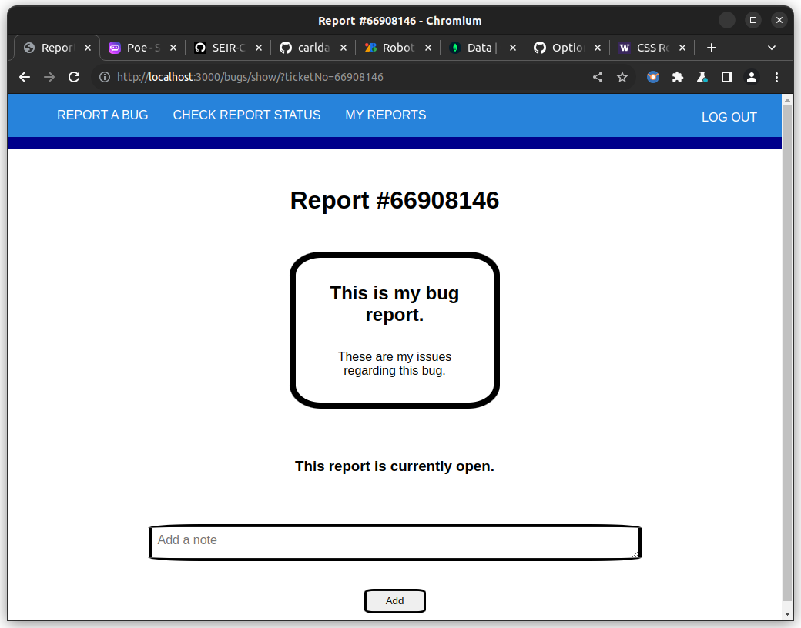

# Bug Tracker

https://bug-tracker-carl-damey-248fea46c845.herokuapp.com/

This is a system designed to be implemented in a web app for users to create bug reports, check the status of their report, as well as edit or delete them (Full CRUD). This app was independently developed in a one-week sprint.

## Technologies Used
### Languages:
- JavaScript
- HTML / EJS
- CSS
### Libraries/Frameworks:
- Node.js - https://nodejs.org/en
- Express.js - https://expressjs.com/
- MongoDB - https://www.mongodb.com/
- Mongoose - https://mongoosejs.com/
- OAuth - https://oauth.net/
### Software:
- VSCodium - https://vscodium.com/
## Getting Started
### Logging In:

Bugs can be reported either with or without an account. Without an account you will need to rely on ticket numbers to view the status of your report. When signed in, you can simply visit the "MY REPORTS" tab to see the reports you've submitted with your Google account.
### Report a Bug:

After clicking on the "REPORT A BUG" tab, enter a brief subject for your report, and add a detailed description below. Click on "send" to send the report.
### Check Report Status:

After Submitting a bug report, you can either use the generated ticket number, or, if you were signed into your google account during the report, you can simply visit the "MY REPORTS" tab to view your reports.

### Notes
While viewing the status of your report, you can add notes below, in case you find or remember relevant information regarding your bug that could be useful to an admin. After posting a note, you can either edit or delete their content, using their respective buttons.

## Icebox Features
### With time I would like to implement the following features:
- Admin interaction, piroritization, response, and closure to bug reports.
- Improved Styling
- Responsive UI

## Original Pitch
This is a system designed to be implemented in a web app for users to create bug reports, check the status of their report, as well as edit or delete them (Full CRUD).
### Wireframes
#### User Interface

#### Admin Interface

#### User Status Checking

### MVP

To reach MVP, this project will need:

 - The ability for a user to submit issues
 - The ability for a user to view their issue status
 - The ability for a user to update and delete their report
 - A database for containing issues and related properties

 #### RESTful Routing and ERD Chart

 
 Please note that all admin related features (red) represent a stretch goal.

### Stretch Goals

If time permits it, I would like to add:

 - Admin interaction with bugs
 - Admin indexing and viewing issues
 - Admin responding, closing, and deleting of reports
 - A responsive design
 - Ability to set priority of issues as an admin, and sort by it
 - A system for users to track submitted issues
 - Display of user OAuth profiles in admin view

### Tech Stack

 - HTML, CSS, JS
 - Node.js, Express.js, OAuth, MongoDB, Mongoose
 - VSCodium

### Potential Roadblocks
The biggest difficulties in this project are likely to be:

 - Differentiation of users and admins
 - Implementation of OAuth
 - Interaction between database documents
